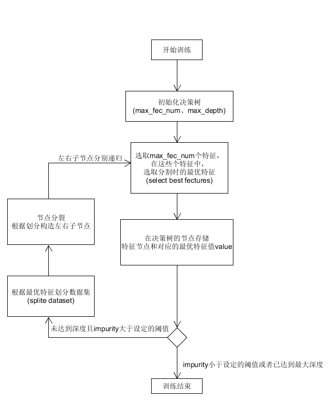

# 随机森林

## 简述

随机森林是决策树的集成算法。随机森林包含多个决策树来降低过拟合的风险。随机森林同样具有易解释性、可处理类别特征、易扩展到多分类问题、不需特征缩放等性质。随机森林分别训练一系列的决策树，因算法中加入随机过程，所以每个决策树又有少量区别。通过合并每个树的预测结果来减少预测的方差，提高在测试集上的性能表现。其中随机森林的随机性体现在每次迭代时，对原始数据进行二次抽样来获得不同的训练数据和对于每个树节点，考虑不同的随机特征子集来进行分裂这两个方面上，除此之外，决策时的训练过程和单独决策树训练过程相同。        

对新实例进行预测时，随机森林需要整合其各个决策树的预测结果。回归和分类问题的整合的方式略有不同。分类问题采取投票制，每个决策树投票给一个类别，获得最多投票的类别为最终结果。回归问题每个树得到的预测结果为实数，最终的预测结果为各个树预测结果的平均值。本次实验目的为实现一个并行的随机森林解决回归问题。

## 基本实现

随机森林为决策树的集成，因此第一步是实现一个决策树。随机森林在应用在分类和回归问题上的时候，其决策树所采用的计算原则是不一样的。

随机森林应用在分类问题上，决策树采用的计算原则是Gini指数。随机森林基于每棵树的分类结果，采用多数表决的手段进行分类。基尼指数表示在样本集合中一个随机选中的样本被分错的概率。Gini指数越小表示集合中被选中的样本被分错的概率越小，也就是说集合的纯度越高，反之，集合越不纯。 

基尼指数（基尼不纯度）= 样本被选中的概率 * 样本被分错的概率

$$Gini(p)=\sum_{k=1}^{K}p_k(1-p_k)=1-\sum_{k=1}^{K}(p_k)^2$$

随机森林应用在分类问题上，决策树采用的原则是最小均方差。即对于任意划分特征A，对应的任意划分点s两边划分成的数据集D1和D2，求出使D1和D2各自集合的均方差最小，同时D1和D2的均方差之和最小所对应的特征和特征值划分点。树的预测是根据叶子结点的均值，因此随机森林的预测是所有树的预测值的平均值。

$$\underbrace{min}_{A,s}\Bigg[\underbrace{min}_{c_1}\sum\limits_{x_i \in D_1(A,s)}(y_i - c_1)^2 + \underbrace{min}_{c_2}\sum\limits_{x_i \in D_2(A,s)}(y_i - c_2)^2\Bigg]$$

实现流程如下所示


主要过程为不断递归分裂节点，直到达到最大的深度或者计算得到impurity比设定的阈值小。

```python
def build(self, data, label):
    self.tree = self.__build_tree(data, label, 0)
    return self.tree

def __build_tree(self, data, label, depth):
    best_fec_index, best_fec_value = self.select_best_fec(data, label)
    if best_fec_index == None:
        return best_fec_value
    tree = {}
    if depth >= self.max_depth:
        return self.cal_mean(label)
    tree["best_fec"] = best_fec_index
    tree["best_val"] = best_fec_value
    l_x, l_y, r_x, r_y = self.split_dataset(data, label, best_fec_index, best_fec_value)
    tree["left"] = self.__build_tree(l_x, l_y, depth+1)
    tree["right"] = self.__build_tree(r_x, r_y, depth+1)
    return tree
```

```python
'''
选取指定的最大个特征，在这些个特征中，选取分割时的最优特征
'''
def select_best_fec(self, data, label):
    fec_num = data.shape[1]
    best_fec_index, best_fec_value = 0, 0
    fec_index = [np.random.randint(fec_num) for i in range(self.max_fec_num)]
    bestS = float('inf')
    S = self.cal_variance(label)
    for index in fec_index:
        for value in set(data.iloc[:, index]):
            l_x, l_y, r_x, r_y = self.split_dataset(data, label, index, value)
            newS = self.cal_variance(l_y) + self.cal_variance(r_y)
            if newS < bestS:
                bestS = newS
                best_fec_index = index
                best_fec_value = value
    if S - bestS < 0.0000001:
        return None, self.cal_mean(label)
    return best_fec_index, best_fec_value
```

决策树其余的具体细节此处展示，实现还是比较简单。决策树的构建完成了，但是对应预测部分，则不断的比较输入的x，其与决策树中对应特征的特征值，小于则向左继续检索，大于向右检索，等于则直接返回，当检索到叶子节点的时候，直接返回当前的值

```python
def predict(self, data):
    if not isinstance(self.tree, dict):
        return None
    return [self.__predict(self.tree, d) for d in data]

def __predict(self, tree, x):
    if x[tree['best_fec']] > tree['best_val']:
        if type(tree['left']) == float:
            return tree['left']
        return self.__predict(tree['left'], x)
    else:
        if type(tree['right']) == float:
            return tree['right']
        return self.__predict(tree['right'], x)
```

决策树的构造和预测已经完成，随机森林实现起来也是比较简单了的

```python
class random_forest_regressor:
    def __init__(self, n_estimators=10, max_fec_num=10, max_depth=10):
        self.n_estimators = n_estimators
        self.max_fec_num = max_fec_num
        self.max_depth = max_depth

    # 基础实现
    def fit(self, data, label):
        self.trees = []
        for _ in range(self.n_estimators):
            dec_tree = decision_tree_regressor(self.max_fec_num, self.max_depth)
            tree = dec_tree.build(data, label)
            self.trees.append(tree)

    # 基础实现
    def predict(self, data):
        if not isinstance(self.trees, list):
            return None
        result = np.zeros(data.shape[0], dtype=np.float)
        for tree in self.trees:
            result += tree.predict(data)
        result /= self.n_estimators
        return result
```

根据预设的参数，训练得到N棵决策树，在预测的时候，则分别获得所有决策树的预测值，然后取平均值，得到随机森林的结果。

## 并行化

决策树的构建本来就是很复杂，需要耗费很多时间的，当训练数据增加和特征数、属性划分点个数增加的情况下，树的叶子节点的增长速度是指数级别的。而且随机森林成功所在就是要建立在构建大量决策树的基础上的，当然我们可以通过改用非递归的方式实现决策树，这样会提升速度，或者减少随机选取的特征数、划分点数目和训练数据的数目，但是这种调整很有可能会影响到随机森林的准确率。

随机森林包含多棵决策树，并且每棵决策树是互不影响的，即在决策时的训练过程和单独决策树训练过程相同。因此我们通过并行化，充分利用计算机的硬件配置，最简单的并行化的实现是每次构建决策树的时候，开启一个进程专门构建该决策树，同时，在结果的预测的时候我们也可以开启多个进程分别进行预测，等到所有进程都运行结束后计算最终结果。

训练并行化

```python
def fit_worker(self, data, label, q):
    dec_tree = decision_tree_regressor(self.max_fec_num, self.max_depth)
    tree = dec_tree.build(data, label)
    q.put(tree)

def mul_fit(self, data, label):
    if not isinstance(self.trees, list):
        return None
    q = multiprocessing.Queue()
    jobs = []
    for _ in range(self.n_estimators):
        p = multiprocessing.Process(target=self.fit_worker, args=(data, label, q))
        jobs.append(p)
    for p in jobs:
        p.join()
    self.trees = [q.get() for j in jobs]
```

预测并行化

```python
# 并行预测
def predict_worker(self, tree, data, q):
    res = tree.predict(data)
    q.put(res)

def mul_predict(self, data):
    if not isinstance(self.trees, list):
        return None
    q = multiprocessing.Queue()
    jobs = []
    for tree in self.trees:
        p = multiprocessing.Process(target=self.predict_worker, args=(tree, data, q))
        jobs.append(p)
    for p in jobs:
        p.join()
    result = [q.get() for j in jobs]
    return sum(result) / self.n_estimators
```

创建N个子进程，在其中构建决策树，但是在决策树数目过多的时候，将会创建过多的进程，占用过多的系统资源，效率将会下降，同时对于计算机的性能要求较高，因此考虑使用进程池进行优化

训练并行化

```python
def pool_fit(self, data, label):
    if not isinstance(self.trees, list):
        return None
    pool = multiprocessing.Pool(processes=4)
    self.trees = []
    jobs = []
    for _ in range(self.n_estimators):
        p = pool.apply_async(self.fit_worker, (data, label, ))
        jobs.append(p)
    pool.close()
    pool.join()
    self.trees = [j.get() for j in jobs]
```

预测并行化

```python
def pool_predict(self, data):
    if not isinstance(self.trees, list):
        return None
    pool = multiprocessing.Pool(processes=4)
    jobs = []
    for tree in self.trees:
        p = pool.apply_async(self.predict_worker, (tree, data, ))
        jobs.append(p)
    pool.close()
    pool.join()
    result = [j.get() for j in jobs]
    return sum(result) / self.n_estimators
```

## 缓存友好

程序的性能与程序执行时访问指令和数据所用的时间有很大关系，而指令和数据的访问时间与相应的 Cache 命中率、命中时间和和缺失损失有关。对于给定的计算机系统而言，命中时间和缺失损失是确定的。因此，指令和数据的访存时间主要由 Cache 命中率决定，而 Cache 的命中率则主要由程序的空间局部性和时间局部性决定。由此以下特定方面对优化缓存非常重要：

* 时间局部性：当访问给定存储器位置时，很可能在不久的将来再次访问相同的位置。理想情况下，此信息仍将在此时缓存。
* 空间局部性：这指的是将相关数据放在彼此之间。缓存发生在很多层次上，而不仅仅是在CPU中。例如，当你从RAM中读取数据时，通常需要比特殊要求更大的内存块，因为程序很快就需要这些数据。 HDD缓存遵循同样的思路。特别是对于CPU高速缓存，高速缓存行的概念很重要。

本次实验之前编写程序都较少考虑过缓存友好的问题，本次并没有提供做相关的优化，只是思考改进的方向。随机森林的随机性体现在每次迭代时，对原始数据进行二次抽样来获得不同的训练数据和对于每个树节点，因此几乎每次迭代都随机抽取一定数量的特征，但是这些特征的存储位置不一定满足局部性原理，因此考虑在这个点上进行优化
